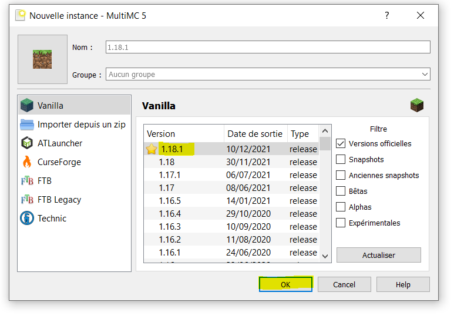

# Listing des mods minecraft

## Installation sur MultiMC 

Créer une nouvelle instance de la version souhaitée pour minecraft. Clique droit "Créer une instance".

Ensuite modifier l'instance, clique droit sur l'instance et "Modifier l'instance"

Installer Fabric, prendre la dernière version et cliquer sur OK pour lancer l'installation.

Ensuite, se rendre dans l'onglet "Mods". Cliquer sur Ajouter et ajouter tous les `.jar` des mods que vous voulez installer.

